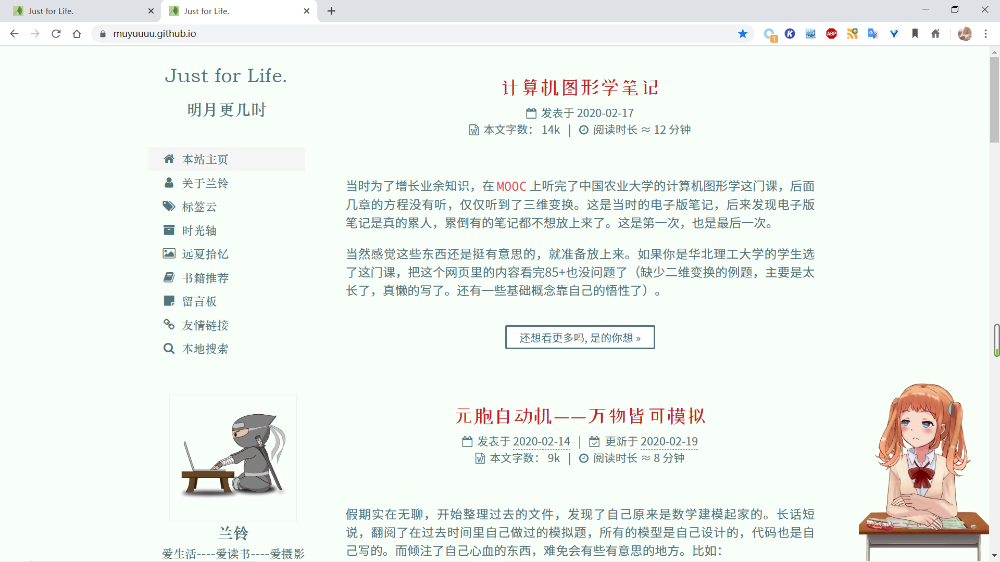

这里是我个人hexo-next博客的配置文件。为什么把配置文件传上来呢？因为之前的配置文件莫名其妙的没了，对，没了.......我查阅了系统日志，并没有找到原因。保险起见，我就把配置文件放了上来，毕竟配置一次挺不容易的。

# 一些技巧

一定不要`download`，推荐`git clone`。修改样式时一定不要直接改源文件，不然下次版本更新发布新功能，`git pull`会很难受。

推荐的修改样式方法参考这里：https://github.com/theme-next/hexo-theme-next/blob/master/docs/DATA-FILES.md

这样改起来也会更简洁、方便，比如本仓库只有几个文件，下次想修改样式修改这几个文件就可以。

# 其他注意事项

- gitalk的ID 我已经修改，请用自己的
- 暂时想不到有需要补充的
- 新版本提供的相关文章，大概是叫`related_posts`，需要安装依赖的插件，且每次`hexo s --watch`或者`hexo g --d`之前一定要`hexo clean`，否则不报错，但文章打不开。

# 维护日志

### 2019-11-22

修补不蒜子不显示问题，[修改方法](https://muyuuuu.github.io/2019/11/22/busuanzi-notdisplay/)，涉及文件：
- theme-next/layout/_macro/post.swig
- theme-next/layout/_third-party/statistics/busuanzi-counter.swig

## 2020-02-21

大规模魔改，他曾经的样子：

